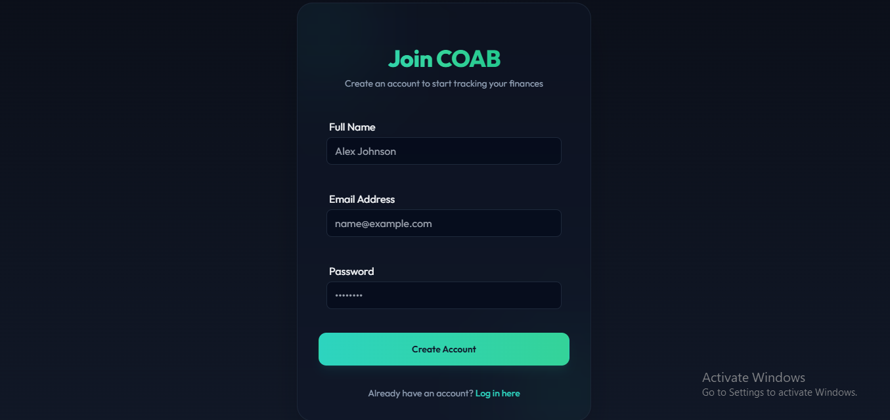
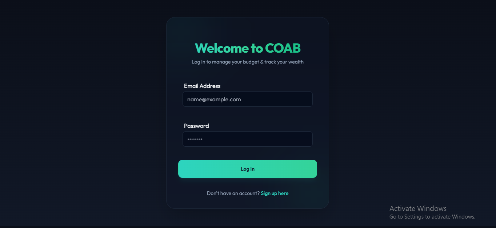
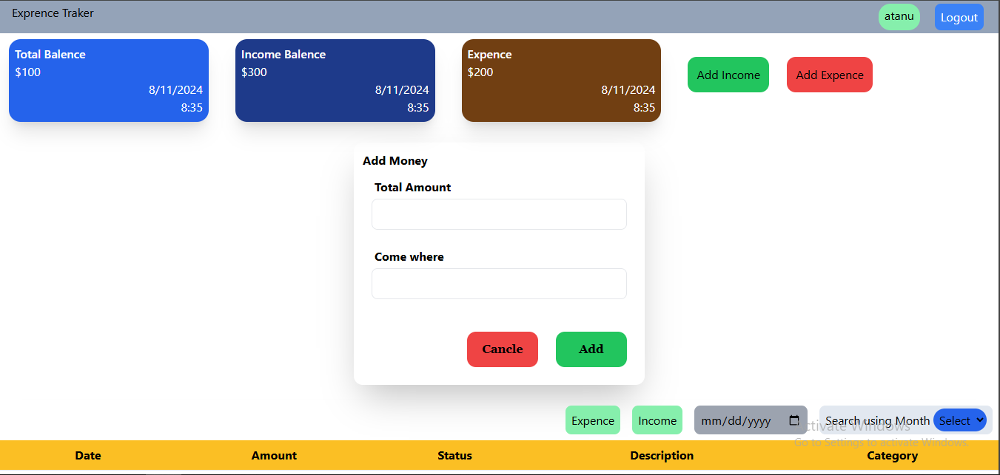
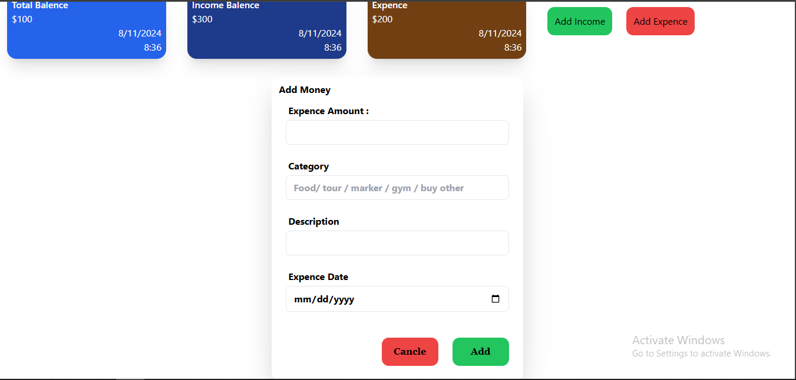

# COAB Expense Tracker

A full-featured, visually rich Expense Tracker web application built using the MERN stack (MongoDB, Express.js, React.js, Node.js) that helps users track expenses, manage budgets, set savings goals, and visualize their financial data through interactive charts.

---

## 🚀 Advanced Enhancements & Key Features

We have upgraded the application with several premium design systems and backend/frontend sync optimizations:

### 🎙️ Real-Time Web Speech API Voice Input
- Native voice entry using browser-supported speech recognition (`window.SpeechRecognition` or `webkitSpeechRecognition`).
- Custom parsing engine: Identifies spoken numbers as the amount, pulls merchant names following prepositions like "at" or "from", and matches keywords to categories dynamically (e.g., "coffee at Starbucks" matches category `food`).

### ⚡ Client-Side Zero-Latency Query Cache
- Implemented a transparent cache (`apiCache`) in the API request client.
- Drastically reduces load times and avoids duplicate fetch triggers during tab switching.
- Auto-invalidates the cache on any state mutation (additions, modifications, deletions) using custom window events.

### 🖼️ Chart.js Visual Canvas Image Exporter
- Downloads Chart.js visual graphs directly as PNG image attachments.
- Actionable download trigger buttons integrated directly on the dashboard card headers.

### 💾 Complete Database & Local Data Backup Sync
- Overhauled backup routines to compile both offline fallback collections (`offline_expenses`, `offline_incomes`, `offline_goals`) and the primary database endpoints into a unified backup JSON file.
- Transparent restore mechanism to sync client states instantly.

### 💀 Premium Skeleton Loaders
- Replaced basic spinners with detailed, pulsing placeholders mimicking charts, tables, calendar blocks, and statistics cards to give a modern, premium user experience.

### 📊 Standardized Category Alignment
- Aligned category IDs (`transport`, `housing`, `healthcare`, `other_exp`) across forms, budget limits progress indicators, and report visualizers to ensure seamless spend auditing.

---

## 🎛️ Detailed View-by-View Features

The COAB Expense Tracker includes nine core workspaces that offer full coverage for personal finance management:

### 1. 📊 Interactive Dashboard View
- **Summary Metrics**: High-level visual display of Total Income, Total Expenses, net Balance, and active Savings Goals progress.
- **Interactive Visualizers**: Spline area charts showing cashflow trends and category allocation distribution doughnut charts powered by Chart.js.
- **Recent Activity Ledger**: Quick-glance list of the latest transactions with automatic color-coded indicator tags.
- **Visual Exporter**: Save any chart as a PNG image for off-app reporting.

### 2. 🧾 Transactions Register
- **Advanced Querying**: Search by keyword or description and filter transactions dynamically by Type (All, Income, Expense), Category, Payment Method (UPI, Cash, Card, Net Banking), and Date Ranges.
- **Record Management**: View complete transactional metadata or delete obsolete records instantly.

### 3. 📈 Income Tracker
- **Stream Allocation**: Track income streams under specific categories (Salary, Freelance, Investments, Other).
- **History Logs**: Chronological table showing historical deposits and corresponding financial notes.

### 4. 🎯 Budget Allocations & Progress
- **Custom Threshold Limits**: Set monthly category-specific spending caps.
- **Real-Time Progress Tracking**: Visual progress bars mapping total category spending against threshold limits.
- **Status Indicators**: Dynamic alerts highlighting categories that are overspent or close to limits.

### 5. 🏆 Savings Target Monitors
- **Goal Customization**: Set saving targets with target amounts, icons, and target dates.
- **Contribution Tracking**: Deduce and isolate funds manually from overall balance via the **Contribute** module.
- **Gamified Rewards**: Built-in confetti canvas animations triggering immediately upon successful goal completion.

### 6. 📅 Calendar Visualizer
- **Cashflow Matrix**: A monthly calendar overlay illustrating transaction dots corresponding to specific days.
- **Daily Audits**: Select a date to view a list of transactions recorded for that day.

### 7. 📑 Reports & Financial Audits
- **Breakdown Analytics**: Detailed summary tables calculating category totals and limit utilizations.
- **Multi-Format Exports**: Support for printing complete financial statements or exporting datasets to Microsoft Excel spreadsheets.

### 8. 🤖 AI Financial Advisor
- **Contextual Insights**: Submits user spending habits to an AI interpreter to obtain recommendations on budget improvements and savings opportunities.

### 9. ⚙️ Settings & Configuration
- **Profile Customizations**: Modify user account identifiers.
- **Global Preferences**: Swap currency symbols (INR, USD, EUR, GBP) and preferred system language (English, Hindi, Spanish, French).
- **Sub-Tab Security & Auth**: Turn on Two-Factor Authentication or modify account passwords securely.
- **Backup & Recovery**: Instantly export local transaction history and database records as a JSON backup file or import JSON backups.

---

## 🛠️ Technologies Used

- **Frontend**: React.js, Tailwind CSS, Date-fns, Lucide React, Chart.js, React-Hook-Form
- **Backend**: Node.js, Express.js
- **Database**: MongoDB
- **Authentication**: JWT cookies with security headers and config switches

---

## ⚙️ Setup & Configuration

### 1. Clone the Repository
```bash
git clone https://github.com/your-username/expense-tracker.git
cd expense-tracker
```

### 2. Configure Environment Variables

Create a `.env` file in the `Backend` directory:
```env
PORT=5000
MONGODB_URI=your_mongodb_connection_string
JWT_SECRET=your_jwt_secret
```

### 3. Install Dependencies & Run

#### Backend Server
```bash
cd Backend
npm install
npm run dev
```

#### Frontend Client
```bash
cd Frontend
npm install
npm run dev
```

The application client runs on `http://localhost:5173` (Vite dev server) and links to the backend server.

---

## 🖼️ Screenshots

<p align="center">
  <b>Signup & Login Screens</b><br>
  
  
</p>

<p align="center">
  <b>Transaction Input Forms</b><br>
  
  
</p>
